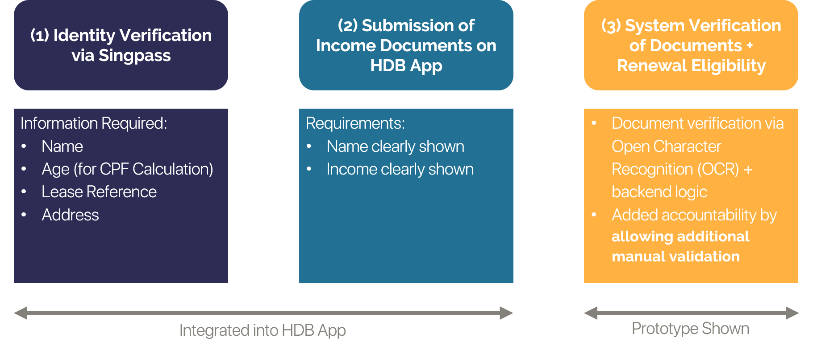
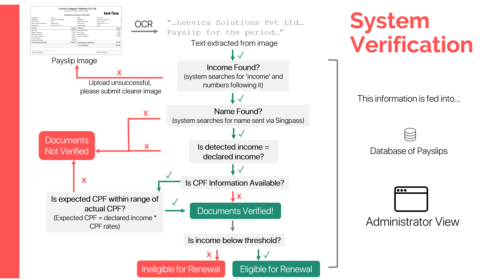
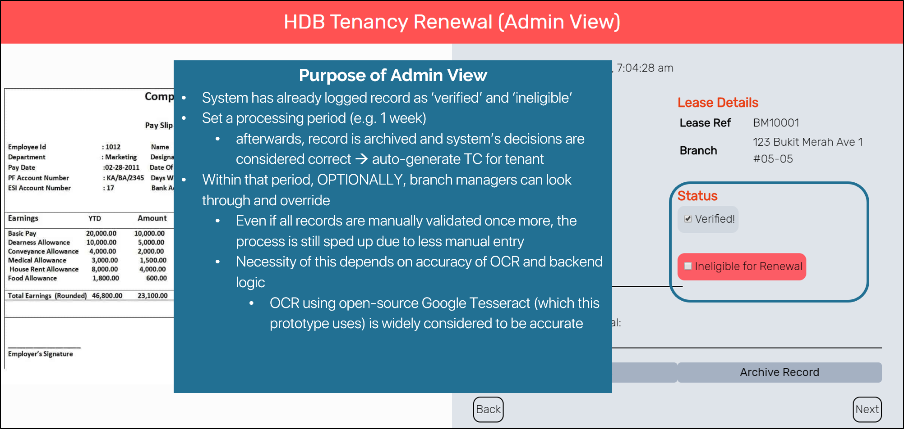
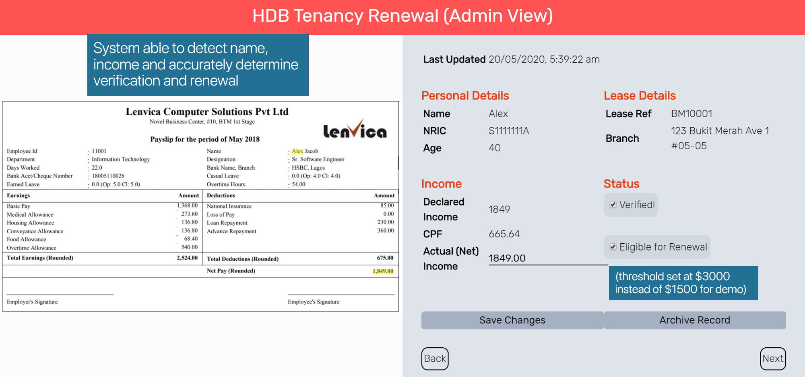

# HDB Tenancy Renewal App :house:
_A CRUD Flask App for digitizing the tenancy renewal declaration process, built with Python Flask, MongoDB and Google Tesseract_

## Description
### Problem Statement
How might we design a **digital process** for tenancy renewal?  
Considerations:
- How to verify identity?
- How to verify income?
  - Taking note that a number of tenants may not have CPF contributions
- Accountability
  - How can we ensure the process remains as valid as with manual verification?

### Proposed Solution
**Solution**

## Demo

## Scaling
- Integrate income declaration form with HDB app to allow name, address and CPF to be extracted from relevant government databases
- Allow fuzzy matching of name and income
- Calculate expected CPF using CPF-approved formula
- Integrate payslip database with auto-alert system to notify tenants on verification status